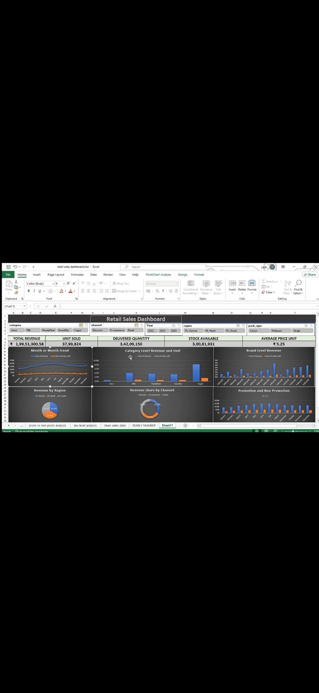

# Retail Sales Dashboard 📊

## Project Overview
This project is an interactive Excel dashboard designed to analyze retail sales performance across different regions, channels, and time periods. It allows stakeholders to track revenue, delivered quantities, and stock availability at a glance.

## 📷 Dashboard Preview

## Key Features
- *KPI Metrics:* Total Revenue, Unit Sold, Delivered Quantity, and Stock Availability.
- *Dynamic Filtering:* Slicers for Channel, Year, and Region.
- *Trend Analysis:* Month-over-Month revenue comparison.
- *Category Insights:* Revenue breakdown by Category and Brand.
- *Promotion Impact:* Analysis of sales during promotional vs. non-promotional periods.

## Tools Used
- *Microsoft Excel* (Pivot Tables, Slicers, Power Query)
- *Data Visualization* (Bar Charts, Donut Charts, Trend Lines)

## How to Use
1. Download the .xlsx file from this repository.
2. Open in Microsoft Excel.
3. Use the slicers at the top to filter data by Region or Channel.
